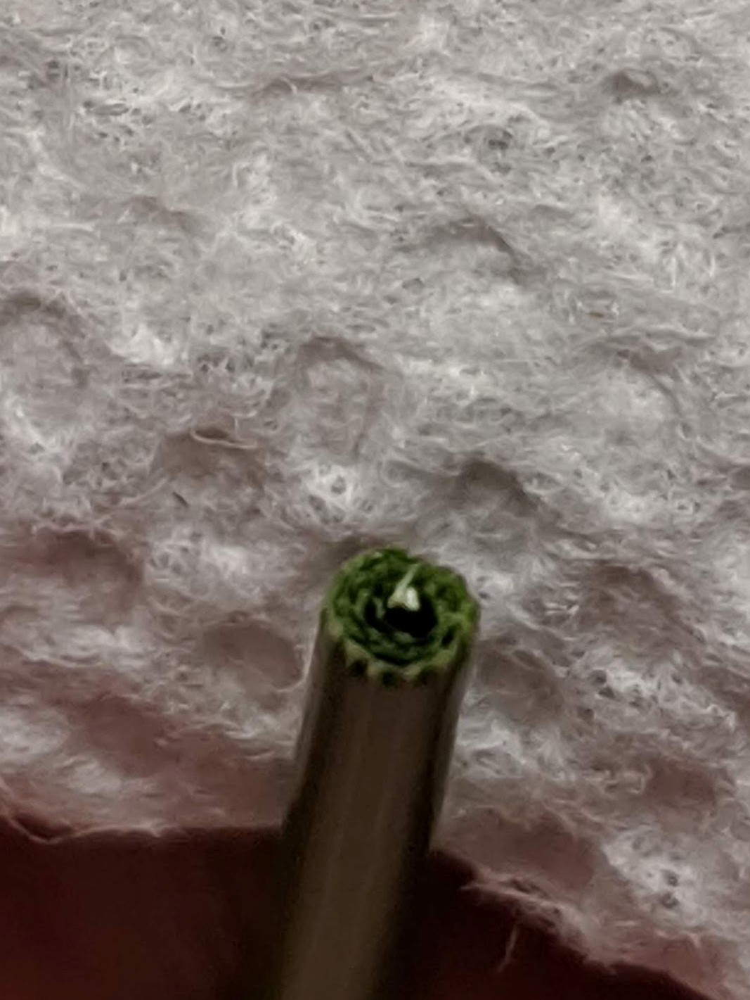
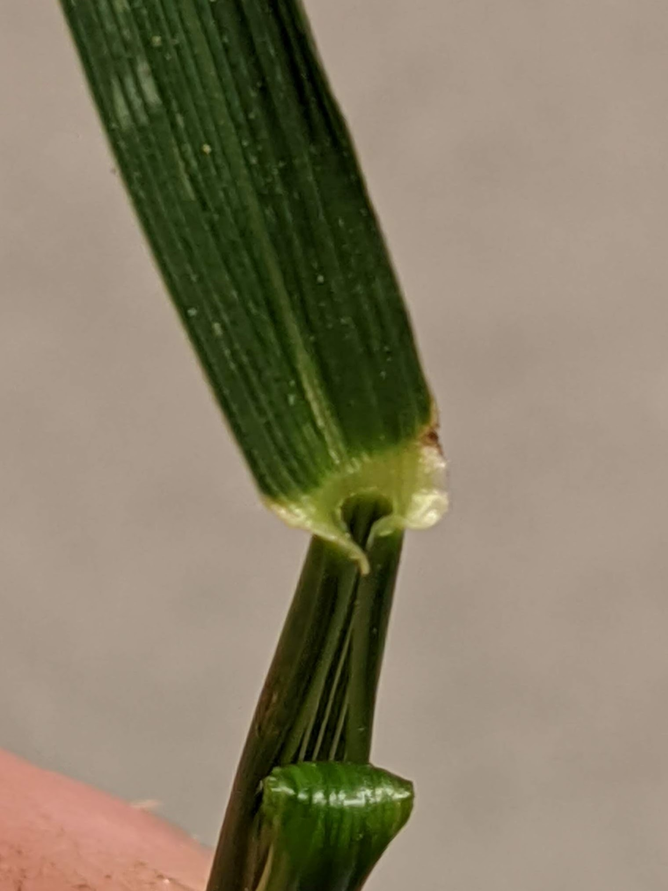
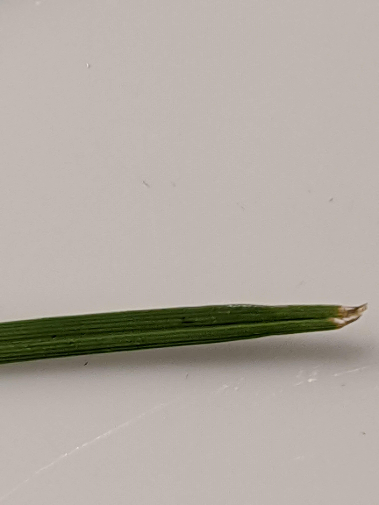

Title: Grass Census 2020
Date: 2020-05-07
Category: Other
tags: grass,house

Now that I've been in the house for over a year, I have a better idea of what types of grasses and weeds are growing in the lawn. There is a surprising amount of diversity, so I am using this post to go through the 4 most common grass types in the yard along with a few pictures to show the identification methodology. In the process of identifying the various grass species, I found the following sites most helpful:

* [Ohio State University Turfgrass Identification Key](https://buckeyeturf.osu.edu/pdf/01_turfgrass_identification.pdf)
* [Penn State Cool Season Turfgrass Identification Page](https://extension.psu.edu/the-cool-season-turfgrasses-identification)
* [Oregon State Grass Structures](https://forages.oregonstate.edu/regrowth/how-does-grass-grow/grass-structures)

Most nomenclature used in the identification and classification of turfgrasses is relatively intuitive, but there are a few specialized terms for the areas around where the blade extends from the main stalk. I therefore included an image from Oregon State guide below as a reference. 

*Collar Closeup from the Oregon State identification guide.*

##Methodology
I have identified 6 main areas in the lawn, each with varying amounts of sunlight, water, and soil type. The are as follows:

1. Left: this area is partially shaded due to a cucumber tree and the side of the house. At first glance, this area seems to have the most robust grass growth. 
2. Front: This are is 100% full sun. It tends to get a bit brown in the summer, not surprising given the predominance of cold weather grass species
3. Right: Partially shaded, this area tends to form a bit of a path since it has the most foot traffic of all the lawn areas. There is only a narrow strip going to the backyard, and the compacted area tends to not have as much growth. I have an ongoing aeration experiment to see if drilling holes in the turf will make a meaningful impact in long term grass coverage. 
4. Back Right: this area is shaded in the morning but in the full light of day in the hot afternoon. This may be the most difficult area to maintain a solid turf coverage due to the combination of lack of light during the cooler morning and full sun during the most intense parts of the summer. 
5. Back Left: I have paid the most attention to this area since when we first moved in the ground was torn up after removing a tree. I attempted to plant several grass seed varieties, and while the lawn is definitely thicker than it was the first year, I am most interested in getting this area looking good in the next year. It is partially shaded with afternoon sun, and gets plenty of water. It is the most sloped of any parts of the yard, so I am curious to see how that impacts any turn development. Below is a picture showing my first (and very unsuccessful) turf grass growing trial. 

*Back left region of yard in late April, 2019*

##Tall Fescue
Per the [University of Maryland General Guidelines for Lawn Maintenance in Maryland](http://www.mdturfcouncil.org/resources/Documents/TT%20Bulletins/TT-63%20General%20Guidelines%20For%20Lawn%20Maintenance%20In%20Maryland.pdf) tall fescue blends are the best variety for the transition zone microclimate in the DC/MD/Northern VA region due to their lower fertilizer, water, and other maintenance requirements. Luckily it already appears this variety is the most widespread in the lawn, with a significant presence in all 5 regions of the yard, though probably weakest in the Back Right section.

Tall fescue is fairly easy to identify. Compared to the other grasses in the yard it is the only one with a rolled vernation, and the lack of prominent mid vein and wide leaves differentiate it from the other major varieties. 

    

        
        
Tall Fescue Fig 1

    

    

        
        
Tall Fescue Fig 2

    

    

         
        
Tall Fescue Fig 3

    

	

        
        
Tall Fescue Fig 4

    

*Figure 1: The rolled vernation is an easy trait that differentiates tall fescue from other cool weather perenial grasses.*  
*Figure 2: Note the wide blade and lack of prominent middle ridge.*  
*Figure 3: Notice the lack of ligule and no hairs.*  
*Figure 4: Here is an in situ young tall fescue bunch just taking hold in the back of the yard. Even though it is newly established, notice how the leaves are already broad.*  

##Kentucky Bluegrass

    

        
        
Tall Fescue Fig 1

    

    

        
        
Tall Fescue Fig 2

    

    

         
        
Tall Fescue Fig 3

    

*Figure 1: Note the folded vernation to differentiates from tall fescue.*  
*Figure 2: The canoe shaped leaf tip is unique to the blue grass species.*  
*Figure 3: Notice the lack of ligule and no hairs.*  

##Fine Fescue

    

        
        
Tall Fescue Fig 1

    

    

        
        
Tall Fescue Fig 2

    

    

         
        
Tall Fescue Fig 3

    

*Figure 1: FIne fescue can be identified by the extremely narrow blade. It does best in the shaddy and cool areas of the yard.*  
*Figure 2: The pictures were difficult due to the small size of the blade.*  
*Figure 3: The ligule is very difficult to see without a lense.*  

##Perenial Rye
Perenial rye is a variety that is specifically called out by UMD as *not* being well suited for Maryland lawns. Unfortunately however, much of the seed that is available in a local hardware store contains perenial rye. Currently, the yard has spots of perenial rye in the two back sections due to previous attempts at overseeding, but they seem to largely be losing out to the fescue and bluegrass blends. You will note a few more pictures for this variety due to the difficulty in distinguishing it from Kentucky blue. 

Perenial rye has a prominante middle vein and a folded vernation like Kentucky bluegrass. To differentiate the two, focus on the tip of the blade, the number of other veins visible on the front of the blade, and on how glossy the back of the blade appears. 

    

        
        
Perenial Rye Figure 1

    

    

        
        
Perenial Rye Figure 2

    

    

        
        
Perenial Rye Figure 3

    

    

         
        
Perenial Rye Figure 4

    

*Figure 1: First here is a full speciman from the back of the yard. Notice the red pigmant at the very base of the stem.*  
*Figure 2: Note the leaf tip tapers to a point compared to the board shape of Kentucky bluegrass.*  
*Figure 3: Perenial rye on the bottom. Note the similarity to the vein structure of tall fescue.*  
*Figure 4: Perenial rye on the bottom, showing the back of each leaf. Note the glossy backside.*  

##Broadleaf Plants and Other Weeds

